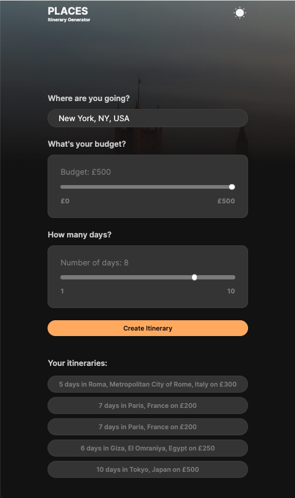
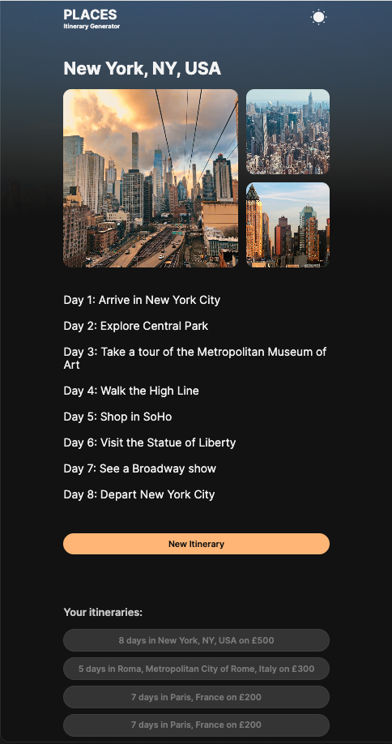

# Places Itinerary App

## Overview
Introducing the ultimate travel planner! With just a few taps, you can input your holiday destination, how long you're visiting, and your budget. Our web app then uses the power of Google Places API to show you stunning images of your destination and the OpenAI API to generate a personalised itinerary tailored to you.

From must-see landmarks to hidden gems, our app ensures you make the most of your trip. Say goodbye to the hassle of hours spent researching and hello to an effortless and efficient travel planning experience. Try out our web app today and start planning your next adventure!

## User Story

```text
AS A traveller
I WANT to find a trip itinerary that suits my budget
SO THAT I can plan a trip accordingly
```

## Acceptance Criteria

* Create a places-itinerary dashboard with form inputs.
  * When a user searches for a city to visit and enters a budget and number of days will
    * Autocomplete search for all the cities around the world.
    * Get a response with suggestions for their itinerary.
    * Get a response with suggestions for the activity they can do.
    * Get images for the city.
    * The user searches saved for another go.


## Technologies used
  * Adobe XD(Wireframing), HTML, CSS, JavaScript, Bootstrap, OpenAI API, Google Places API


## Mock-Up

The following demonstrates the application functionality:






## Links

- [Github code link](https://github.com/EmadSaeed2/places-itinerary).
- [Github live link](https://emadsaeed2.github.io/places-itinerary).